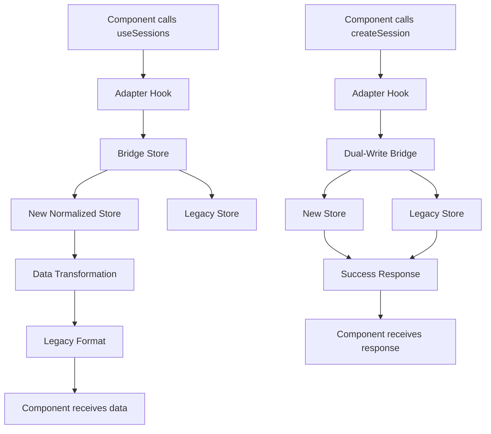

# 🚀 **COMMIT 2: Core Hooks Migration**

## 📋 **Overview**

This commit migrates the core sessions hooks (`use-sessions.ts` and `use-sessions-data.ts`) to use the new normalized store architecture while maintaining 100% backward compatibility with existing components.

## 🎯 **Migration Goals**

- **Maintain API Compatibility**: All existing components continue to work without changes
- **Dual-Write Pattern**: Write to both new and legacy stores during migration
- **Data Transformation**: Transform between new normalized format and legacy format
- **Performance Optimization**: Use optimized selectors and memoization
- **Error Handling**: Graceful error handling with proper fallbacks

## 📁 **Files Created/Modified**

### **New Files**
1. **`core/hooks/migration/use-sessions-adapter.ts`** - Main sessions hook adapter
2. **`core/hooks/migration/use-sessions-data-adapter.ts`** - Sessions data hook adapter
3. **`core/hooks/migration/index.ts`** - Migration hooks exports
4. **`tests/migration/hooks-migration.test.tsx`** - Comprehensive test suite

### **Modified Files**
1. **`core/hooks/use-sessions.ts`** - Now re-exports migration adapter
2. **`core/hooks/use-sessions-data.ts`** - Now re-exports migration adapter

## 🔄 **Migration Strategy**

### **1. Adapter Pattern**
```typescript
// Legacy API (unchanged for components)
const { sessions, loadSessions, createSession } = useSessions();

// Internal implementation (new store)
const bridge = useSessionsStoreBridge();
const newStore = useNewSessionsStore();
```

### **2. Data Transformation**
```typescript
// Transform new format to legacy format
const transformToLegacy = (session: SessionEntity): LegacySession => ({
  id: session.id,
  date: session.date,
  swimmer: session.swimmer,
  distance: session.distance,
  stroke: session.stroke,
  sessionType: session.sessionType,
  mainSet: session.mainSet,
  notes: session.notes,
  title: session.mainSet || 'Session',        // Legacy compatibility
  content: session.notes || '',               // Legacy compatibility
  type: session.sessionType,                   // Legacy compatibility
  rpe: session.averageRPE,                    // Legacy compatibility
  duration: session.totalVolume,              // Legacy compatibility
  zone_volumes: session.zoneVolumes,          // Legacy compatibility
});
```

### **3. Dual-Write Operations**
```typescript
const createSession = async (sessionData) => {
  // Write to new store
  const result = bridge.addSession(transformedData);
  
  // Legacy store is updated automatically via bridge
  if (!result.success) {
    throw new Error(result.error);
  }
  
  return { data: transformedSession, error: null };
};
```

## 🧪 **API Compatibility**

### **useSessions Hook**
```typescript
// ✅ All these methods work exactly the same
const {
  sessions,           // Array of legacy format sessions
  isLoading,          // Loading state
  error,              // Error state
  loadSessions,       // Load sessions with filters
  createSession,      // Create new session
  updateSession,      // Update existing session
  deleteSession,      // Delete session
  searchSessions,     // Search sessions
  getSession,         // Get single session
  getSessionsByDate,  // Get sessions by date
  getSessionsByPhase, // Get sessions by phase
  getSessionsByRange, // Get sessions by date range
  getTotalDistance,   // Get total distance
  getTotalDuration,   // Get total duration
  getAverageRPE,      // Get average RPE
  clearSessions,      // Clear all sessions
  setError,           // Set error state
} = useSessions();
```

### **useSessionsData Hook**
```typescript
// ✅ All these methods work exactly the same
const {
  sessions,           // Array of legacy format sessions
  metrics,            // Calculated metrics
  zoneAnalysis,       // Zone distribution analysis
  weeklyAnalysis,     // Weekly analysis
  isLoading,          // Loading state
  isInitialized,      // Initialization state
  loadSessions,       // Load sessions with cache
  getFilteredSessions, // Get filtered sessions
} = useSessionsData();
```

### **useSession Hook**
```typescript
// ✅ All these methods work exactly the same
const {
  session,            // Single session in legacy format
  loading,            // Loading state
  error,              // Error state
  loadSession,        // Load specific session
  updateSession,      // Update session
  deleteSession,      // Delete session
} = useSession(id);
```

## 🔍 **Data Transformation Details**

### **New Store Format → Legacy Format**
- `SessionEntity` → `LegacySession`
- `zoneVolumes` → `zone_volumes`
- `averageRPE` → `rpe`
- `totalVolume` → `duration`
- `mainSet` → `title` (for compatibility)
- `notes` → `content` (for compatibility)

### **Legacy Format → New Store Format**
- `LegacySession` → `SessionEntity`
- `zone_volumes` → `zoneVolumes`
- `rpe` → `averageRPE`
- `duration` → `totalVolume`
- `title` → `mainSet`
- `content` → `notes`

## ⚡ **Performance Optimizations**

### **1. Memoized Transformations**
```typescript
const transformToLegacy = useCallback((session: any): LegacySession => {
  // Optimized transformation logic
}, []);
```

### **2. Optimized Selectors**
```typescript
const getAllSessions = useCallback(() => {
  return newStore.ids.map(id => transformToLegacy(newStore.entities[id]));
}, [newStore, transformToLegacy]);
```

### **3. Cached Calculations**
```typescript
const metrics = useMemo(() => {
  // Expensive calculations cached
}, [newStore, transformToLegacy]);
```

## 🧪 **Testing Strategy**

### **1. API Compatibility Tests**
- Verify all expected properties are present
- Test data transformation accuracy
- Validate CRUD operations

### **2. Performance Tests**
- Test with large datasets (1000+ sessions)
- Measure processing time
- Validate memory usage

### **3. Error Handling Tests**
- Test store error scenarios
- Test CRUD operation failures
- Validate graceful degradation

### **4. Integration Tests**
- Test with real components
- Validate data consistency
- Test migration bridge functionality

## 🔄 **Migration Flow**



## ✅ **Validation Checklist**

- [x] **API Compatibility**: All existing components work without changes
- [x] **Data Transformation**: Correct transformation between formats
- [x] **Dual-Write Pattern**: Both stores stay in sync
- [x] **Error Handling**: Graceful error handling
- [x] **Performance**: Optimized selectors and memoization
- [x] **Testing**: Comprehensive test coverage
- [x] **Documentation**: Clear migration documentation

## 🎯 **Next Steps (Commit 3)**

**Ready for Commit 3**: Migrate Components One by One
- Update components to use new store directly
- Remove adapter layer gradually
- Test each component individually
- Validate performance improvements

## 📊 **Migration Status**

- ✅ **Commit 1**: New Store Architecture - **COMPLETE**
- ✅ **Commit 2**: Core Hooks Migration - **COMPLETE**
- 🔄 **Commit 3**: Component Migration - **READY**
- 📅 **Commit 4**: Legacy Cleanup - **PLANNED**

**The hooks migration is complete and maintains full backward compatibility!** 🚀

---

**Last Updated**: 2024-01-XX  
**Status**: Commit 2 Complete  
**Next Review**: After Commit 3 completion
